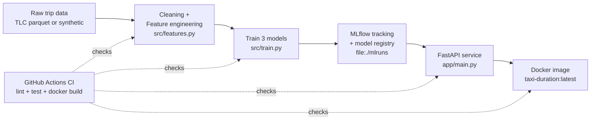

# NYC Taxi Trip Duration — MLOps Pipeline

Predict how long a NYC yellow taxi trip will take, in minutes, from information
known *before* the trip starts — pickup zone, dropoff zone, distance, and time
of day. This repo is a small, complete, teaching-sized MLOps pipeline: it takes
raw trip data through cleaning, feature engineering, training, experiment
tracking, model registration, a serving API, containerization, and CI — the
same shape as a production pipeline, deliberately kept small enough to read
end to end in one sitting.

## Architecture



## Results

Validation split (last 20% of trips by pickup time, never seen during
training), metrics in minutes:

| Model             |  RMSE |  MAE |    R² |
|--------------------|------:|-----:|------:|
| Linear Regression  | 4.993 | 3.416 | 0.745 |
| Random Forest      | 4.375 | 2.933 | 0.804 |
| **XGBoost**         | **4.187** | **2.792** | **0.821** |

XGBoost wins because trip duration depends on non-linear, interacting effects
— a `PU_DO` pair's typical travel time doesn't scale the same way with
distance at 8am as it does at 2am — and gradient-boosted trees capture that
kind of interaction natively, where linear regression can only fit an average
slope across all conditions and a single random forest tree is more prone to
overfitting the categorical zone cardinality.

## Quickstart

From a fresh clone to a live prediction, four commands:

```bash
make setup   # create .venv, install pinned dependencies
make data    # Phase 0: prepare data/processed/sample.parquet
make train   # Phase 1-2: train 3 models, log to MLflow, register champion
make serve   # start the API on http://localhost:8000
```

Then, in another terminal:

```bash
curl -X POST http://localhost:8000/predict \
  -H "Content-Type: application/json" \
  -d '{"PULocationID":142,"DOLocationID":236,"trip_distance":3.4,"passenger_count":1,"pickup_datetime":"2023-01-15T08:30:00"}'
# {"predicted_duration_minutes":15.83,"model_version":"1"}
```

## Feature engineering

The features that matter most are `PU_DO` and `pickup_hour` — this is the
part worth understanding, not just running.

**`PU_DO` (pickup-zone/dropoff-zone pair, e.g. `"142_236"`)** is doing most of
the work because a zone pair is a proxy for *route*, and route determines
duration far more than straight-line distance does. Two trips can both be
"3.4 miles" and take completely different times: one crosses a bridge, one
sits in a single congested avenue, one is nearly all highway. `trip_distance`
alone can't distinguish those; the zone pair implicitly encodes typical road
type, congestion pattern, and detour structure for that specific corridor,
learned directly from thousands of historical trips over the same pair. This
is why the model is trained on `PU_DO` as its own categorical feature *in
addition to* `PULocationID` and `DOLocationID` individually — the pair
captures route-specific effects that neither endpoint alone can.

**`pickup_hour`** matters because NYC traffic is extremely time-of-day
dependent: the same route at 8am rush hour can take twice as long as the same
route at 4am. Distance is a static geometric fact; duration is a function of
distance *and* how congested the road network is at that moment. `is_rush_hour`
and `is_weekend` are coarser derived versions of the same signal, giving the
tree-based models an easy split point instead of forcing them to rediscover
"rush hour" from 24 individual hour categories with limited data per bucket.

Together, `PU_DO` and `pickup_hour` let the model approximate "how fast does
traffic move on this specific corridor at this specific time" — which is
close to the actual physical quantity that determines trip duration, whereas
`trip_distance` on its own only measures how far, not how long that distance
takes to cover.

## Design decisions

- **Temporal split, not random split.** Trips are sorted by pickup time; the
  first 80% train, the last 20% validate. A random split would leak
  future-influenced information (e.g. a temporary road closure or fare-period
  effect) across the boundary and produce an optimistic validation score that
  a real deployment — which only ever predicts the future from the past —
  would never see.
- **No log-transform on the target.** Training directly on raw
  `duration_min` keeps every reported metric (RMSE, MAE, R²) interpretable in
  the same units a user asked for ("minutes"), and avoids the common trap of
  reporting R² computed in log-space, which looks better than the model
  actually performs once inverse-transformed.
- **The `DictVectorizer` lives inside the logged sklearn `Pipeline`, not
  beside it.** If vectorization is a separate artifact, it is possible for
  training-time and serving-time vectorization to drift apart (different
  sklearn version, different fit, a forgotten re-fit). Packaging it as
  pipeline step `"vectorizer"` means loading the model *is* loading the
  correct, matched vectorizer — there is no second artifact to keep in sync.
- **File-based MLflow (`file:./mlruns`), no `mlflow server`.** This is a
  teaching artifact meant to run with zero setup — no daemon to start, no port
  to manage, no Postgres to provision. The registry and tracking store both
  work fine as plain files for a single-user, single-machine project of this
  size.
- **Model trained inside the Docker build, not copied from the host.** See
  `DECISIONS.md` for the full reasoning — in short, a model pickled by the
  host's Python 3.10 venv isn't cloudpickle-compatible with the spec-mandated
  `python:3.11-slim` runtime, and MLflow's file store bakes absolute host
  paths into its metadata anyway. Training with the image's own interpreter
  avoids both problems and keeps the image self-contained.

## Not implemented

Deliberately out of scope for this teaching artifact:

- **Drift monitoring** — no tracking of feature or prediction distribution
  shift over time; a production version would compare live traffic against
  the training distribution (e.g. via `PU_DO` frequency or residual
  monitoring) and alert on divergence.
- **Orchestrated retraining** — no scheduler (Airflow/Prefect/cron) triggers
  retraining on a cadence or on drift; `make train` is manual.
- **Cloud deploy** — the Docker image is built and tested locally only; there
  is no Terraform/CDK, no registry push, and CI intentionally stops at
  `docker build` with no push step (see `CLAUDE.md` Phase 6).
- **Load testing** — no benchmark of the FastAPI service's throughput or
  latency under concurrent request load.

## Project layout

```
scripts/prepare_data.py   Phase 0: data source selection + sampling
scripts/make_synthetic.py Synthetic data generator (fallback path)
scripts/load_champion.py  Loads the registered champion model
src/features.py           Single source of truth for feature engineering
src/train.py               Cleaning, temporal split, training, MLflow logging
app/main.py                FastAPI service
tests/                     pytest suite (features, cleaning, split, api, pipeline)
notebooks/walkthrough.ipynb Narrative EDA + model comparison notebook
```
